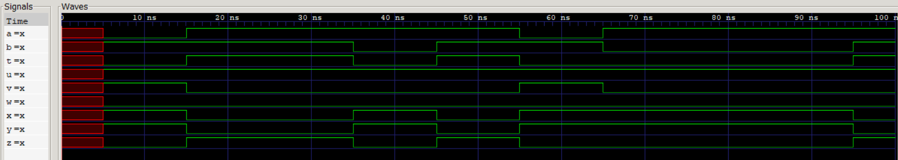
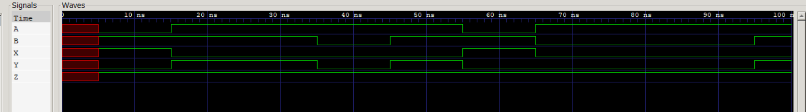
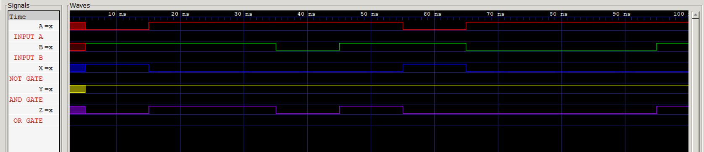

# 01 · Basic Logic Gates and Universality of NAND/NOR

Study of the basic logic ICs (OR 7432, AND 7408, NOT 7404, NAND 7400, NOR 7402, XOR 7486, XNOR 74266), and proof that NAND and NOR are each universal: NOT, AND and OR can be built from either one alone.

## Files

| File | What it is |
|------|------------|
| [`verilog/basic_gates.v`](verilog/basic_gates.v) | All seven basic gates on inputs `a`, `b` |
| [`verilog/nand_universal.v`](verilog/nand_universal.v) | NOT, AND and OR built only from NAND gates |
| [`verilog/nor_universal.v`](verilog/nor_universal.v) | NOT, OR and AND built only from NOR gates |
| `verilog/tb_*.v` | Testbenches: random inputs, checked against `&`, `\|`, `~`, `^` |
| [`logisim/`](logisim) | One circuit per 74-series IC, plus the two universality circuits |
| [`report/`](report) | Lab report ([PDF](report/basic_logic_gates.pdf)) |

## How the universal gates work

| Output | From NAND only | From NOR only |
|--------|----------------|---------------|
| NOT A | `NAND(A, A)` | `NOR(A, A)` |
| A AND B | `NAND(NAND(A,B), NAND(A,B))` | `NOR(NOR(A,A), NOR(B,B))` |
| A OR B | `NAND(NAND(A,A), NAND(B,B))` | `NOR(NOR(A,B), NOR(A,B))` |

The NAND and NOR versions mirror each other through De Morgan's laws.

## Run

```bash
bash ../run_all.sh 01
```

## Waveforms

Basic gates:


NAND universality (X = NOT A, Y = A AND B, Z = A OR B):


NOR universality (X = NOT A, Y = A OR B, Z = A AND B):

