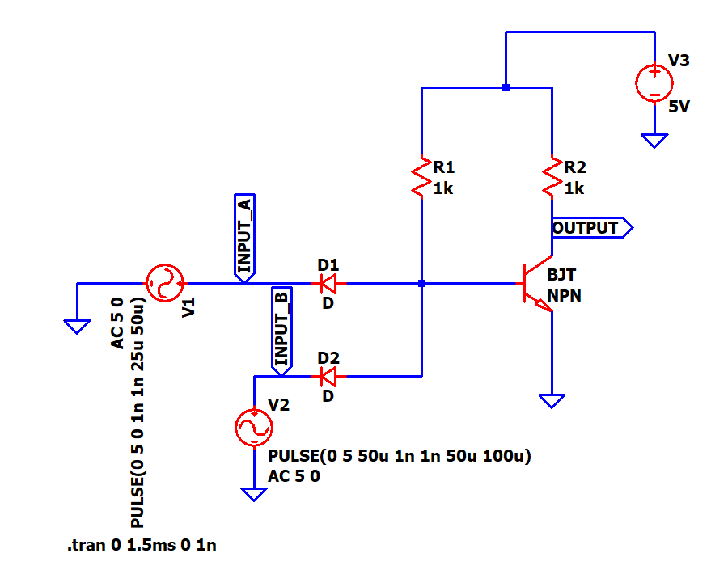
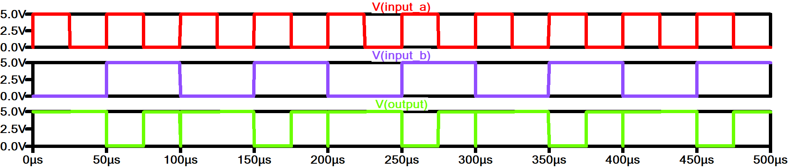

# 02 · DTL Logic Circuit (NAND Gate)

A diode-transistor logic (DTL) NAND gate simulated at the transistor level in LTspice: two input diodes form the AND, and an NPN transistor inverts it.

## Files

| File | What it is |
|------|------------|
| [`ltspice/dtl_circuit.asc`](ltspice/dtl_circuit.asc) | LTspice schematic: 2 diodes, NPN BJT, two 1 kΩ resistors, 5 V supply |
| [`report/`](report) | Lab report ([PDF](report/dtl_logic_circuit.pdf)) |

## Circuit

**How it works.** If either input is low (0 V), its diode conducts and pulls the base node low, so the transistor is off and the output is pulled up to 5 V through R2. Only when both inputs are high are both diodes reverse-biased. Then current flows through R1 into the base, the transistor saturates, and the output drops low. That is the NAND truth table.

## Simulation

Input A is a 50 µs-period square wave and input B a 100 µs-period square wave, so all four input combinations appear every 100 µs. The output is low only while both inputs are high.

## Run

Open `ltspice/dtl_circuit.asc` in [LTspice](https://www.analog.com/en/resources/design-tools-and-calculators/ltspice-simulator.html) and press Run (the `.tran` command is in the schematic). Plot `V(input_a)`, `V(input_b)` and `V(output)`.
