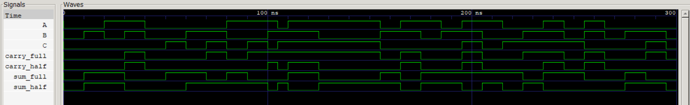
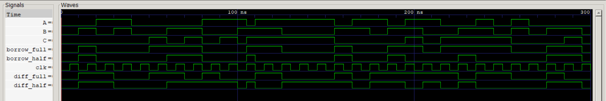

# 03 · Half and Full Adder / Subtractor

Design and verification of half and full adders and subtractors, using logic gates, logic ICs and Verilog.

## Files

| File | What it is |
|------|------------|
| [`verilog/adder.v`](verilog/adder.v) | Half adder and full adder (dataflow) |
| [`verilog/subtractor.v`](verilog/subtractor.v) | Half subtractor and full subtractor (dataflow) |
| `verilog/tb_adder.v`, `tb_subtractor.v` | Full truth table, then random inputs. Checked against real arithmetic: `{carry, sum} = A + B + C` and `{borrow, diff} = A − B − C` |
| [`logisim/`](logisim) | Adder and subtractor circuits |
| [`report/`](report) | Lab report ([PDF](report/adder_subtractor.pdf)) |

## Equations

| | Sum / Difference | Carry / Borrow |
|---|---|---|
| Half adder | `A ⊕ B` | `A·B` |
| Full adder | `A ⊕ B ⊕ C` | `A·B + B·C + C·A` |
| Half subtractor | `A ⊕ B` | `A'·B` |
| Full subtractor | `A ⊕ B ⊕ C` | `A'·B + (A' + B)·C` |

## Run

```bash
bash ../run_all.sh 03 -v
```

```
---- Full Adder ----                    ---- Full Subtractor ----
A B C | sumH carryH | sumF carryF       A B C | diffH borrowH | diffF borrowF
0 0 0 | 0 0 | 0 0                       0 0 0 | 0 0 | 0 0
0 0 1 | 0 0 | 1 0                       0 0 1 | 0 0 | 1 1
0 1 0 | 1 0 | 1 0                       0 1 0 | 1 1 | 1 1
0 1 1 | 1 0 | 0 1                       0 1 1 | 1 1 | 0 1
1 0 0 | 1 0 | 1 0                       1 0 0 | 1 0 | 1 0
1 0 1 | 1 0 | 0 1                       1 0 1 | 1 0 | 0 0
1 1 0 | 0 1 | 0 1                       1 1 0 | 0 0 | 0 0
1 1 1 | 0 1 | 1 1                       1 1 1 | 0 0 | 1 1
```

## Waveforms

Adder:


Subtractor:


> The truth-table screenshots in `images/` were captured before a testbench fix: their seventh full-adder/subtractor row reads `0 1 1` instead of `1 1 0`, because the random-input stage started before the table finished. The text tables above are from the fixed testbench.
