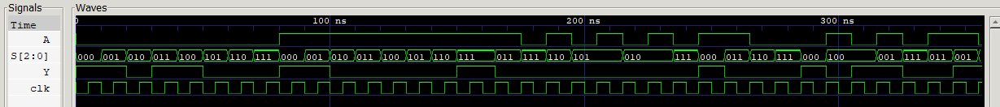

# 04 · Implementing a Boolean Function with an 8:1 Multiplexer

A four-variable Boolean function F(S2, S1, S0, A) implemented with a single 8-to-1 multiplexer: three variables drive the select lines, and each data input is tied to `0`, `1`, `A` or `A'`.

## Files

| File | What it is |
|------|------------|
| [`verilog/mux_boolean.v`](verilog/mux_boolean.v) | 8:1 MUX with the data inputs wired for F |
| [`verilog/tb_mux_boolean.v`](verilog/tb_mux_boolean.v) | Truth table for A = 0 and A = 1, then 20 random inputs, all checked |
| [`logisim/`](logisim) | The MUX implementation, and the same function built from gates |
| [`report/`](report) | Lab report ([PDF](report/mux_boolean_function.pdf)) |

## Data input assignment

| Select S2 S1 S0 | 000 | 001 | 010 | 011 | 100 | 101 | 110 | 111 |
|---|---|---|---|---|---|---|---|---|
| Data input | I0 | I1 | I2 | I3 | I4 | I5 | I6 | I7 |
| Tied to | 1 | 1 | 0 | A' | A' | 0 | 0 | A |

## Run

```bash
bash ../run_all.sh 04 -v
```

## Waveform


