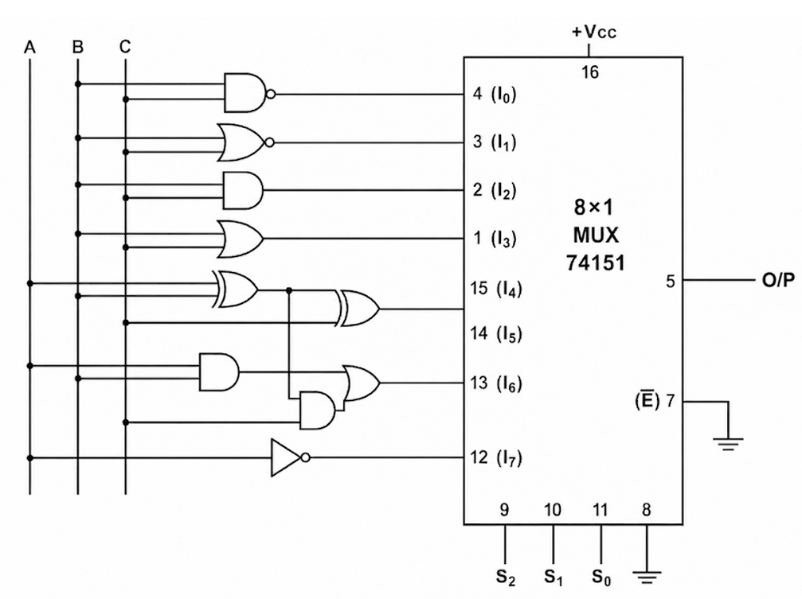
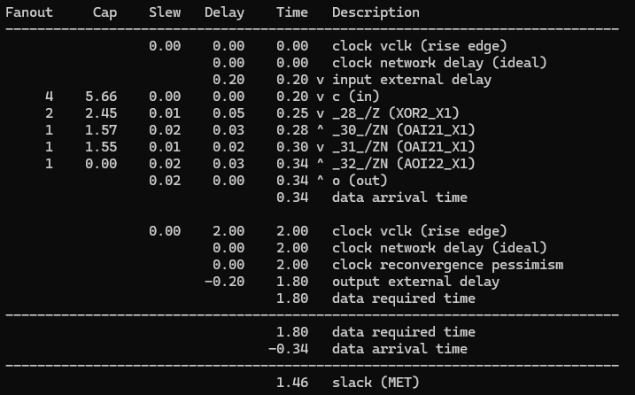

# 05 · ALU: from RTL to Layout

A 1-bit, 8-operation arithmetic logic unit built around a 74151 8:1 multiplexer, then taken through a complete open-source chip flow: RTL simulation, synthesis, formal equivalence checking, static timing analysis, and place-and-route.



## Operations

| S2 S1 S0 | Output | Operation |
|----------|--------|-----------|
| 000 | `(B·C)'` | NAND |
| 001 | `(B+C)'` | NOR |
| 010 | `B·C` | AND |
| 011 | `B+C` | OR |
| 100 | `B ⊕ C` | XOR |
| 101 | `A ⊕ B ⊕ C` | full-adder sum |
| 110 | `(A ⊕ B)·C + A·B` | full-adder carry |
| 111 | `A'` | NOT |

## Files

| File | What it is |
|------|------------|
| [`verilog/alu.v`](verilog/alu.v) | RTL |
| [`verilog/tb_alu.v`](verilog/tb_alu.v) | All 64 combinations of inputs and select lines, checked against a reference model (sum and carry against real addition) |
| [`flow/syn.ys`](flow/syn.ys) | Yosys synthesis to the Nangate45 open cell library |
| [`flow/alu_netlist.v`](flow/alu_netlist.v) | Synthesized gate-level netlist (17 cells) |
| [`flow/sta.tcl`](flow/sta.tcl), [`flow/sta.sdc`](flow/sta.sdc) | OpenSTA timing check of the netlist, 2 ns clock |
| [`flow/config.mk`](flow/config.mk), [`flow/constraint.sdc`](flow/constraint.sdc) | OpenROAD-flow-scripts config for place-and-route (sky130hd, 10 ns clock) |
| [`report/`](report) | Lab report ([PDF](report/alu.pdf)) |

## 1. RTL simulation

```bash
bash ../run_all.sh 05 -v  # PASS: 64 checks
```

## 2. Synthesis (Yosys, Nangate45)

```bash
cd flow
yosys -s syn.ys           # writes alu_netlist.v
```

The ALU maps to 17 standard cells: AOI/OAI complex gates, NAND2, AND2, OR2, XOR2 and inverters.

**Equivalence check.** The netlist has been formally proven to match the RTL for every input. Yosys builds a miter (both designs side by side, with outputs compared) and a SAT solver shows the outputs can never differ.

## 3. Static timing analysis (OpenSTA)

```bash
sta sta.tcl               # or: openroad sta.tcl
```

With a 2 ns virtual clock and 0.2 ns input/output delays, the worst path (`c` → XOR2 → OAI21 → OAI21 → AOI22 → `o`) arrives at 0.34 ns against a required time of 1.80 ns: **slack +1.46 ns (met)**.



## 4. Place and route (OpenROAD-flow-scripts, sky130hd)

```bash
# from the OpenROAD-flow-scripts flow/ directory
make DESIGN_CONFIG=/path/to/Digital_Electronics/05-alu/flow/config.mk
```

The die is 100 × 100 µm with a 10 µm core margin at 60% placement density. All setup paths meet the 10 ns clock with more than 4 ns of slack.

<p align="center"></p>

> Synthesis in step 2 targets Nangate45 (for the quick STA check), while the ORFS run in step 4 targets sky130hd, so their netlists differ.
