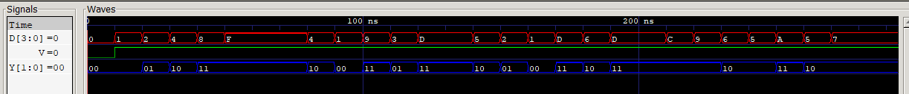

# 08 · 4-to-2 Priority Encoder

Encodes the highest-numbered active input among four into a 2-bit code. A valid flag `V` shows whether any input is active, which distinguishes "input D0 active" from "no input active" (both give `Y = 00`).

## Files

| File | What it is |
|------|------------|
| [`verilog/priority_encoder_4to2.v`](verilog/priority_encoder_4to2.v) | Priority encoder with an `if`/`else if` chain (D3 has the highest priority) |
| [`verilog/tb_priority_encoder_4to2.v`](verilog/tb_priority_encoder_4to2.v) | Directed cases, then 20 random inputs, all checked |
| [`logisim/priority_encoder_4to2.circ`](logisim/priority_encoder_4to2.circ) | Gate-level circuit |
| [`report/`](report) | Lab report ([PDF](report/priority_encoder_4to2.pdf)) |

## Truth table

| D3 D2 D1 D0 | Y1 Y0 | V |
|-------------|-------|---|
| 0 0 0 0 | 0 0 | 0 |
| 0 0 0 1 | 0 0 | 1 |
| 0 0 1 X | 0 1 | 1 |
| 0 1 X X | 1 0 | 1 |
| 1 X X X | 1 1 | 1 |

## Run

```bash
bash ../run_all.sh 08 -v
```

## Waveform


