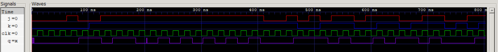

# 11 · J-K Master-Slave Flip-Flop (Gate Level)

A J-K master-slave flip-flop modeled the way the 7476 IC is built: eight NAND gates and an inverter, each with a 1 ns delay. It is falling-edge triggered and has active-low asynchronous preset and clear.

## Files

| File | What it is |
|------|------------|
| [`verilog/jk_ms_ff.v`](verilog/jk_ms_ff.v) | Gate-level model: master steering gates, master SR latch, slave steering gates, slave SR latch |
| [`verilog/tb_jk_ms_ff.v`](verilog/tb_jk_ms_ff.v) | Hold, set, reset and toggle, async preset/clear, then 20 random J/K pairs. Every row is checked against the characteristic equation `Q⁺ = J·Q' + K'·Q` |
| [`logisim/`](logisim) | Gate-level and block-level circuits |
| [`report/`](report) | Lab report ([PDF](report/jk_master_slave_flip_flop.pdf)) |

## Run

```bash
bash ../run_all.sh 11 -v
```

```
  J  K  |  Q    Q_bar  | Operation
--------------------------------------
  0  0  |  0      1    | HOLD
  1  0  |  1      0    | SET
  0  0  |  1      0    | HOLD
  0  1  |  0      1    | RESET
  1  1  |  1      0    | TOGGLE
  1  1  |  0      1    | TOGGLE
--------------------------------------
  PRE_bar=0 → Q=1  Q_bar=0  (expect Q=1)
  CLR_bar=0 → Q=0  Q_bar=1  (expect Q=0)
```

**Timing detail.** After a falling clock edge, the new Q takes 3–4 ns to appear (inverter, slave steering gate, then the slave latch). The testbench samples 5 ns after each edge. Sampling at 2 ns, as an earlier version did, reads the old value, so each row looks one clock late.

## Waveform


