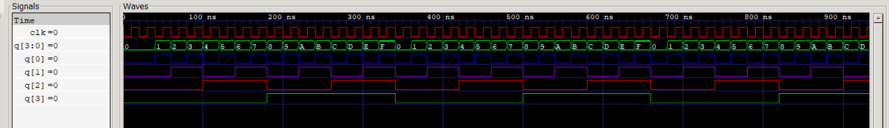

# 13 · 4-bit Asynchronous (Ripple) Up Counter

Four toggling flip-flops in a chain, as in the 7493 IC. The first flip-flop is clocked by the external clock, and each later one is clocked by the output of the one before it, so the count ripples through the stages.

## Files

| File | What it is |
|------|------------|
| [`verilog/async_counter_4bit.v`](verilog/async_counter_4bit.v) | Negative-edge T flip-flop module, chained four times |
| [`verilog/tb_async_counter_4bit.v`](verilog/tb_async_counter_4bit.v) | Reset, then 17 clocks; checks the count goes up by one each clock and wraps from 15 to 0 |
| [`logisim/async_counter_4bit.circ`](logisim/async_counter_4bit.circ) | Counter built from J-K flip-flops |
| [`report/`](report) | Lab report ([PDF](report/async_up_counter_4bit.pdf)) |

## Run

```bash
bash ../run_all.sh 13 -v
```

```
 | QD  QC  QB  QA | Decimal
-----------------------------
 |  0   0   0   1  |   1
 |  0   0   1   0  |   2
 ...
 |  1   1   1   1  |   15
 |  0   0   0   0  |   0
 |  0   0   0   1  |   1
```

## Waveform

Each output runs at half the frequency of the one before it:


