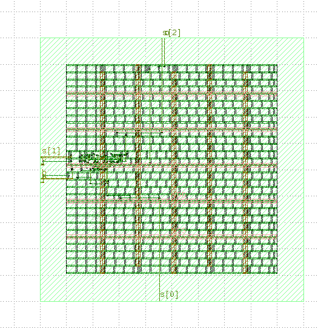

# Digital Electronics Lab

[](https://github.com/Rakib-Hasnat/Digital_Electronics/actions/workflows/simulate.yml)

Thirteen digital electronics experiments, from basic logic gates to a 4-bit ripple counter. Each one is built at more than one level: as a gate- or IC-level circuit in Logisim, as Verilog with a self-checking testbench, and, where it fits, as a transistor-level SPICE simulation or a full RTL-to-layout flow.

Coursework for the Digital Electronics lab, Department of EEE, University of Chittagong.

<p align="center">
  
  <br><em>The lab-05 ALU after placement and routing with OpenROAD (sky130hd), viewed in KLayout</em>
</p>

## Highlights

- **Every Verilog design is tested automatically.** `bash run_all.sh` compiles and runs all 16 testbenches, and a GitHub Action runs it on every push. Combinational testbenches compare the design against an independent reference model (for example, the full adder is checked against `A + B + C`), so a wrong output fails the build.
- **RTL to layout.** The [ALU](05-alu) is synthesized to the Nangate45 cell library with Yosys, its netlist is formally proven equivalent to the RTL, its timing is checked with OpenSTA, and it is placed and routed with OpenROAD-flow-scripts.
- **Gate-level sequential logic.** The [D](10-d-flip-flop) and [J-K master-slave](11-jk-master-slave-flip-flop) flip-flops are built from NAND gates with propagation delays, the way the 74-series ICs are, rather than with behavioral `always` blocks.
- **Below the gate level.** The [DTL NAND gate](02-dtl-logic-circuit) is simulated with diodes and a BJT in LTspice.

## Labs

| # | Lab | Verilog | Logisim | Other | Report |
|---|-----|:-------:|:-------:|-------|:------:|
| 01 | [Basic logic gates and NAND/NOR universality](01-basic-logic-gates) | ✓ | ✓ | 74-series IC pinouts | [PDF](01-basic-logic-gates/report/basic_logic_gates.pdf) |
| 02 | [DTL logic circuit (NAND)](02-dtl-logic-circuit) | | | LTspice | [PDF](02-dtl-logic-circuit/report/dtl_logic_circuit.pdf) |
| 03 | [Half and full adder / subtractor](03-adder-subtractor) | ✓ | ✓ | | [PDF](03-adder-subtractor/report/adder_subtractor.pdf) |
| 04 | [Boolean function with an 8:1 multiplexer](04-mux-boolean-function) | ✓ | ✓ | | [PDF](04-mux-boolean-function/report/mux_boolean_function.pdf) |
| 05 | [ALU (8 operations)](05-alu) | ✓ | | Yosys, OpenSTA, OpenROAD | [PDF](05-alu/report/alu.pdf) |
| 06 | [3-to-8 line decoder](06-decoder-3to8) | ✓ | | | [PDF](06-decoder-3to8/report/decoder_3to8.pdf) |
| 07 | [4-to-16 line decoder](07-decoder-4to16) | ✓ | | | [PDF](07-decoder-4to16/report/decoder_4to16.pdf) |
| 08 | [4-to-2 priority encoder](08-priority-encoder-4to2) | ✓ | ✓ | | [PDF](08-priority-encoder-4to2/report/priority_encoder_4to2.pdf) |
| 09 | [1-to-8 demultiplexer](09-demux-1to8) | ✓ | | | [PDF](09-demux-1to8/report/demux_1to8.pdf) |
| 10 | [D flip-flop (gate level)](10-d-flip-flop) | ✓ | ✓ | | [PDF](10-d-flip-flop/report/d_flip_flop.pdf) |
| 11 | [J-K master-slave flip-flop (gate level)](11-jk-master-slave-flip-flop) | ✓ | ✓ | | [PDF](11-jk-master-slave-flip-flop/report/jk_master_slave_flip_flop.pdf) |
| 12 | [T flip-flop (sync and async preset/clear)](12-t-flip-flop) | ✓ | ✓ | | [PDF](12-t-flip-flop/report/t_flip_flop.pdf) |
| 13 | [4-bit asynchronous up counter](13-async-up-counter-4bit) | ✓ | ✓ | | [PDF](13-async-up-counter-4bit/report/async_up_counter_4bit.pdf) |

Each report is also included as an editable `.docx` next to the PDF.

## Running the simulations

You need [Icarus Verilog](https://steveicarus.github.io/iverilog/) and, to view waveforms, [GTKWave](https://gtkwave.sourceforge.net/). On Ubuntu or WSL:

```bash
sudo apt install iverilog gtkwave
bash run_all.sh       # run every testbench
bash run_all.sh -v    # also show each testbench's output
bash run_all.sh 11    # run only lab 11
```

```
  PASS  basic_gates       PASS: 7 checks
  PASS  adder             PASS: 28 checks
  PASS  alu               PASS: 64 checks
  ...
16 passed, 0 failed
```

Waveforms are written to `build/<test>/` (for example `gtkwave build/jk_ms_ff/jk_ms_ff.vcd`).

To run a single lab by hand:

```bash
cd 03-adder-subtractor/verilog
iverilog -g2012 -o sim adder.v tb_adder.v && vvp sim
```

## Repository layout

```
NN-lab-name/
├── verilog/    design (name.v) and testbench (tb_name.v)
├── logisim/    gate- and IC-level circuits (.circ, Logisim Evolution)
├── ltspice/    transistor-level schematic (lab 02)
├── flow/       synthesis, timing and place-and-route scripts (lab 05)
├── images/     waveforms, schematics, layout
└── report/     lab report (.pdf and .docx)
run_all.sh      runs every testbench
```

## Tools

Icarus Verilog · GTKWave · Logisim Evolution · LTspice · Yosys · OpenSTA · OpenROAD-flow-scripts · KLayout

## Author

Md. Rakib Hasnat Akash, Department of EEE, University of Chittagong · [GitHub](https://github.com/Rakib-Hasnat)
